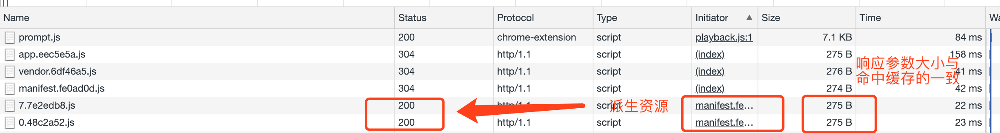
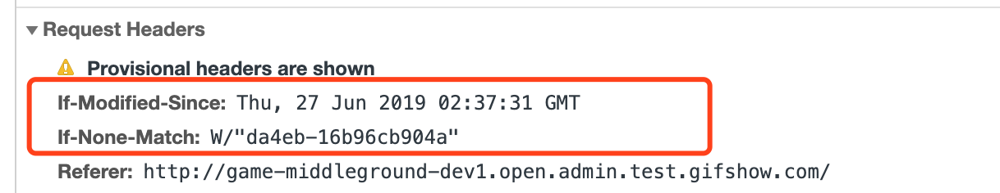
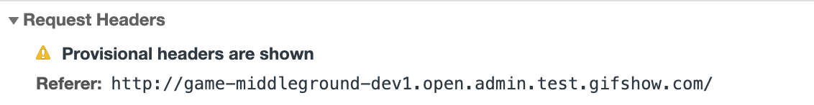

# 缓存策略

## 几种缓存状态

* 200
    * Status Code: 200 OK (from memory cache) 内存缓存
        * base64 图片
        * 主资源
    * Status Code: 200 OK (from disk cache) 磁盘缓存
        * 派生资源
    * 强制缓存状态，直接使用已有缓存
* 304
    * Status Code: 304 Not Modified
    * 协商缓存状态
    
* 一种迷惑状态（应该也是协商缓存）
    
    主资源状态码 304  
    派生资源状态吗 200
    但是两个响应参数大小几乎相同（响应报文的大小）应该是协商缓存
    
    对比区别
    
    派生资源的请求头(request) 缺失了 `If-Modified-Since` `If-None-Match`
    
    
    `Provisional headers are shown`
    

## 浏览器缓存策略

* 强制缓存
    * Expires  --  缓存过期时间
    * Cache-Control  --  缓存有效时间
        * public -- 客户端和代理服务器都可以缓存
        * private -- 客户端可以缓存
        * max-age=1000 -- 缓存有效时间1000ms
        * no-cache -- 直接进行协商缓存
        * no-store -- 完全不缓存
* 协商缓存
    * Last-Modified -- 上次修改时间
    * ETag -- 资源的特定版本的标识符

* 优先级

    强制缓存（Cache-Control > Expires） > 协商缓存 (ETag > Last-Modified)

## webpack 长效缓存

* 文件内容有变化时，重新打包的文件名哈希值会有变化，撤销变化后重新打包哈希值也会复原。
* 配置浏览器的强制缓存策略

## 方案
设置超长的 max-age=31536000 一年，搭配webpack的长效缓存打包

## 参考：
1. [304 Not Modified](https://developer.mozilla.org/zh-CN/docs/Web/HTTP/Status/304)
2. [前端也要懂Http缓存机制](https://juejin.im/post/5b70edd4f265da27df0938bc#heading-10)
3. [阿里巴巴：浏览器的强缓存和协商缓存（一面）](https://github.com/frontend9/fe9-interview/issues/29)
4. [深入理解浏览器的缓存机制](https://www.infoq.cn/article/8VU-VCrhoxducaFPrNOL)