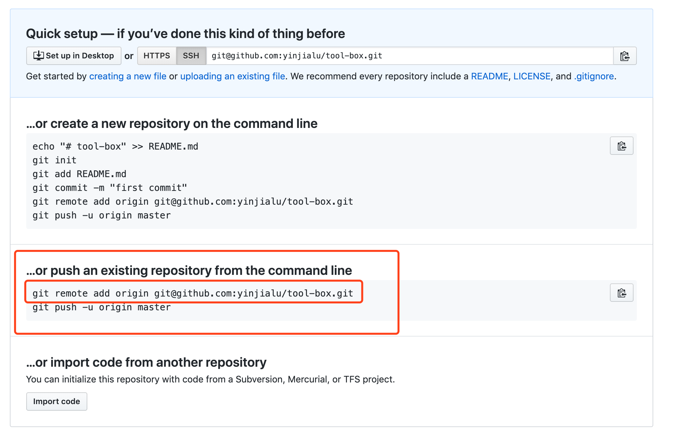

# github 常用操作

## 为本地项目创建远程仓库

1. 在github上新建同名仓库，保持默认设置，readme.md 也不需要
2. 进入新建的仓库

3. 参考：`git remote add origin git@github.com:yinjialu/tool-box.git`
4. `git push --set-upstream origin master`

## 在package.json 里面配置远程仓库地址