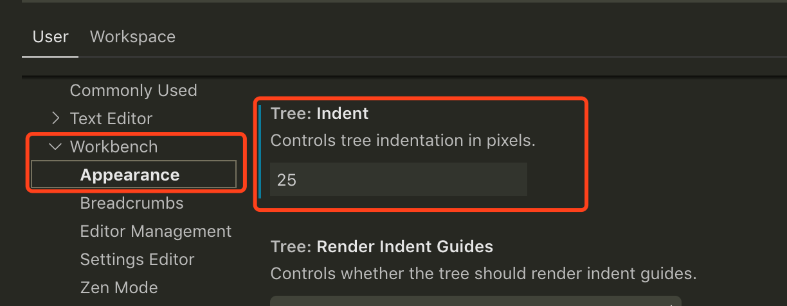

# 调教VSCode

## 调整侧边栏文件树缩进

* `command` + `,` 打开设置面板
* 找到 Workbench -> Tree:Indent 如下图：修改数字看侧边栏缩进效果

* 继续折腾
    
    [VS Code CSS addition to increase readability on file tree.](https://gist.github.com/jakewtaylor/e92acd697409e53a73ebf8e0145d4c28)

## 调整字体大小
* 设置快捷键
    * Perferences => Keyboard Shortcuts
        * Editor Font Zoom In 大
        * Editor Font Zoom Out 小
        
## 整体放大缩小
* `command` + `+`
* `command` + `-`